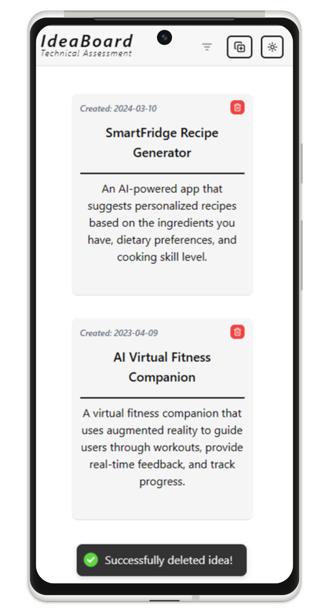
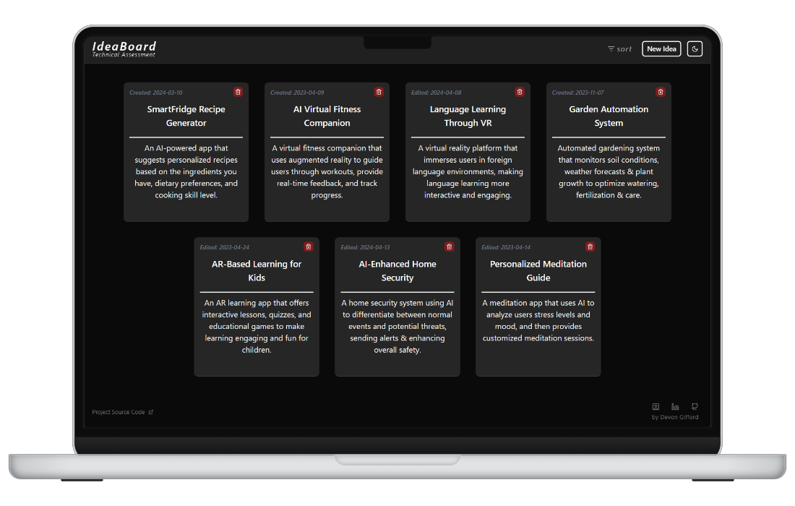
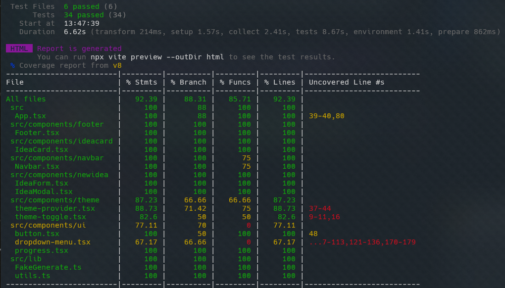

  <h2>Take-Home Assessment</h2>
  <h4>Responsive Frontend React Idea Board with Local Storage Persistance<h4>
  <h3> 
    <a href='https://idea-board-murex.vercel.app/', target='_blank'>
      <h5>live demo ↗</h5>
    <a/>
  </h3>
  

    <a href="https://github.com/DevonGifford/ClearScore/issues">Report Bug</a>
    &nbsp;·&nbsp;
    <a href="https://github.com/DevonGifford/ClearScore/issues">Request Feature</a>
    

<h3 align='center'>
Tech Used in this Project:
<h3>

     

### Introduction:

---

This project was created as part of a time-constrained frontend assessment for ClearScore. Developed within 6 to 8 hours, it utilizes modern technologies like Tailwind CSS and ShadCN UI Library for rapid development. Prioritized simplicity, accessibility, and thorough testing.

The project meets all core and stretch requirements, including responsive design, sorting options, and character countdown. Additionally, it implements extra features such as dark/light themes and new-idea modals with quick generation of mock ideas.

> [!NOTE] 
> **For reviewers:**  
> - Please feel free to disregard boilerplate ShadCN code in `components/ui`
> - You can find known issues and potential future enhancements [here](https://github.com/DevonGifford/Menu--TechnicalAssignment#-known-issues--potential-improvements--).

<!-- DEMO IMAGE  -->

        
     

 

### 🔑 Assessment Requirements:

---

✔ Fully Responsive Page.

✔ Each Idea Tile Should Contain a Title and Description.

✔ Idea CRUD Functionality.

✔ Inline Edit Ideas.

✔ Display Created/Updated Time.

✔ Focus Title Field for New Ideas Prompt.

✔ Sort Ideas by Creation Date or Alphabetically.

 

##### Stretch Features:

✔ Utilizes localStorage API to Persist Current State.

✔ Character Countdown for Description Text.

✔ Unobtrusive Notification for Updates.

 

##### Bonus Features:

✔ Light and Dark Theme Styling.

✔ Quick Generate Mock Ideas.

 

##### What We're Looking For:

✔ Hosting on a Live Site.

✔ Clean, Concise Code.

✔ Stylish Solution.

✔ Demonstration of CSS Knowledge.

✔ Isomorphic/Universal SPA.

✔ Consistent Use of ES6 and ES7 Features.

✔ Utilization of PostCSS.

✔ Detailed README.

✔ Testing with modern tooling (RTL etc.)

❌ MEN (Mongo, Express, Node) Stack Websites.  
_This is a Frontend Assessment and Doesn't Require a Dedicated Backend or Database._

❌ We Build Using the Webpack Module Bundler and Lerna Package Manager.  
_This App Uses Vite and Thus Utilizes Vite's Own Builder._

 

<!-- -------------------------------------------------------------------------- -->

### 🧪 Test Coverage:

---

> [!WARNING] 
> **Note on Testing;**  
> Since ShadCN components are already extensively tested within the library itself, they do not need to be individually tested in this project.

         

(<a href="#readme-top">back to top</a>)

  
